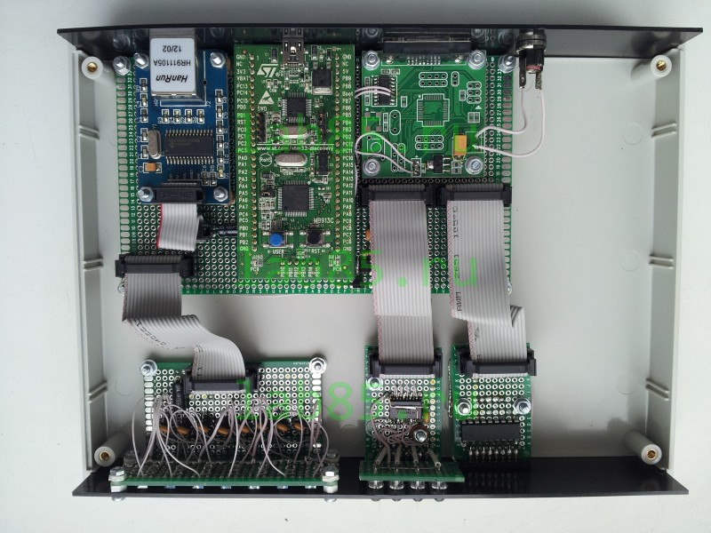

# ethernet_tel_server
Ethernet telemetry WEB server.
Mini prj.

CPU: stm32f100 - 8kb RAM (STM32VLDISCOVERY)
ETH: ENC28J60

 - 8 input analog (ADC 12 bits),
 - 8 input digital,
 - 8 output digital.

[https://lab85.ru](https://lab85.ru/index.php/laboratoriya-stati/34-ethernet-web-mini-server-telemetriya)

